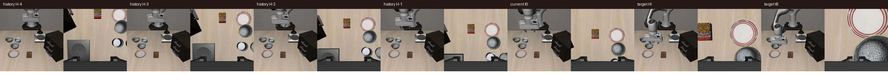
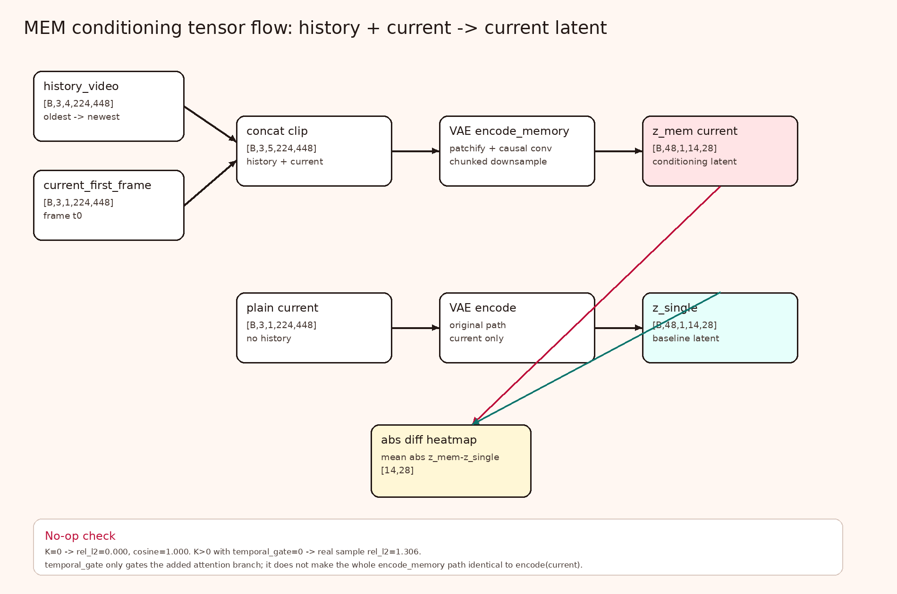
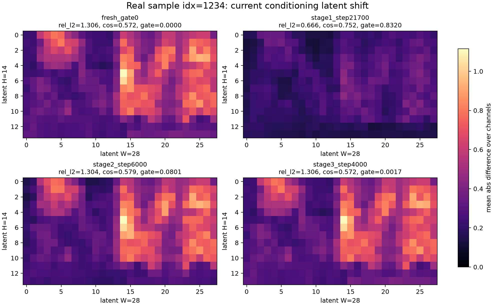
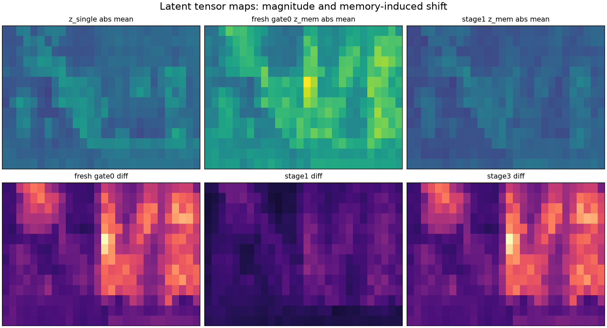
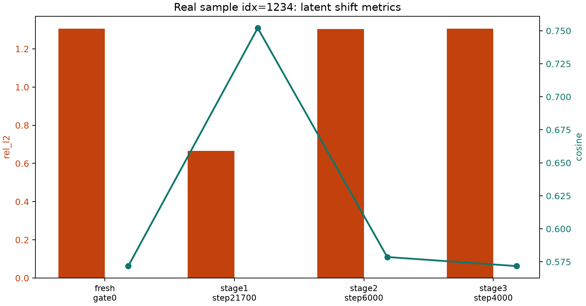
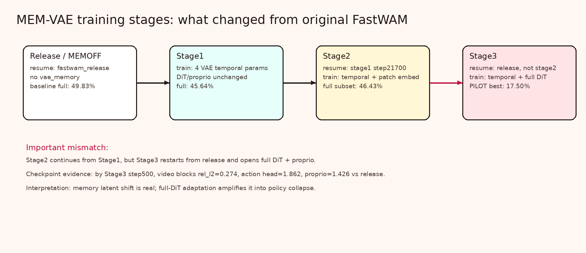
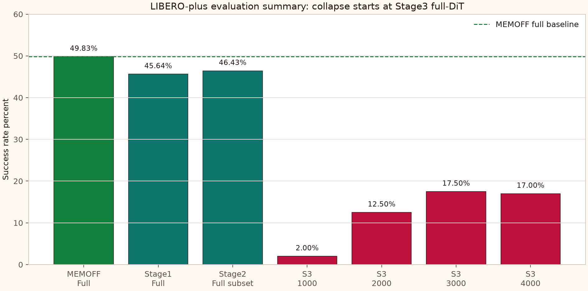
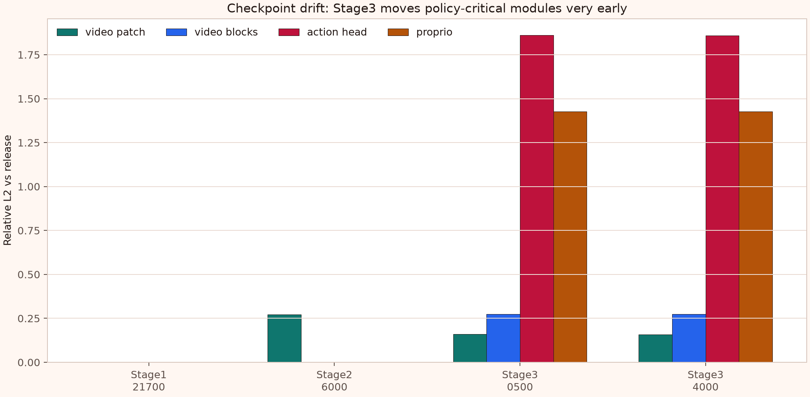
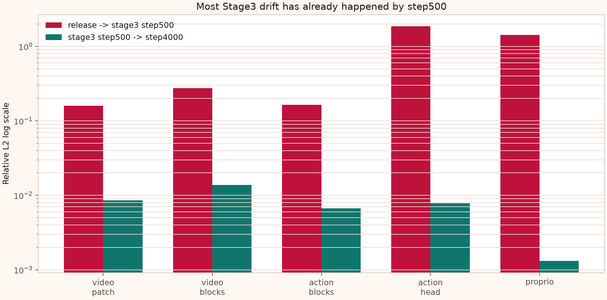

# MEM-VAE 图像与张量流转图册

本图册只引用 PNG 图片，不依赖 HTML。所有图片位于 `docs/26-06-21/`。

## 1. 真实样本图像时间线

数据来源：远端 `RobotVideoDataset`，使用 `runs/mem_temporal_libero_stage3/config.yaml` 实例化，样本 `idx=1234`。



这张图展示了 memory 输入实际看到的 4 帧 history，以及当前帧 `t0` 和后续 target 帧。这里的图像是双相机水平拼接后的 `[3,224,448]`。

## 2. Memory path 的张量形状流转



这张图对应代码路径：

- `src/fastwam/models/wan22/fastwam.py:340`：`history_video` 和 `current_first_frame` 拼成 `[history + current]`
- `src/fastwam/models/wan22/fastwam.py:342`：调用 `vae.encode_memory(...)`
- `src/fastwam/models/wan22/wan_video_vae.py:1512`：`encode_memory` 返回 trailing current latent

关键点：`temporal_gate=0` 只 gate 新增 temporal attention branch，不保证整条 `encode_memory(history+current)` 等价于 `encode(current)`。

## 3. 真实样本 latent 差异热力图

实验：比较同一个真实样本上 `z_mem = encode_memory(history+current)` 与 `z_single = encode(current)`。



读图方式：

- 颜色越亮表示 `mean |z_mem - z_single|` 越大。
- `fresh_gate0`：强制 `temporal_gate=0`，但仍有 `rel_l2=1.306`。
- `stage1_step21700`：差异降到 `rel_l2=0.666`，说明 stage1 的 temporal params 确实学到一部分补偿。
- `stage2_step6000` 和 `stage3_step4000`：又接近 fresh gate0 的差异水平。

## 4. Latent tensor map 对比



上排是 latent magnitude map，下排是 diff map。它帮助看出：stage1 不是完全无效，它确实把 memory-induced shift 压低了；而 stage3 的 VAE memory 状态几乎回到 fresh gate0 的效果。

## 5. 真实样本 latent 指标



这张图同时画了：

- `rel_l2 = ||z_mem - z_single|| / ||z_single||`
- `cosine(z_mem, z_single)`

它是 heatmap 的标量摘要。

## 6. 训练阶段流转



这张图强调一个关键实验设计问题：stage2 是从 stage1 继续，但 stage3 是从 release 重新开始并解冻 full DiT，不是从 stage2 continuation。

## 7. 评测成功率



这张图对应 `evaluate_results/libero_plus/**/summary.csv`。stage1/stage2 没有大崩，stage3 PILOT 明显崩。

## 8. Checkpoint 权重漂移



指标定义：

```text
rel_l2 = ||theta_ckpt - theta_release||_2 / ||theta_release||_2
```

结论：stage3 step500 时 action head、proprio、video blocks 已经明显偏离 release。

## 9. Stage3 早期漂移 vs 后期漂移



这张图用 log scale 显示：stage3 的主要漂移发生在 release -> step500，step500 -> step4000 的变化很小。
