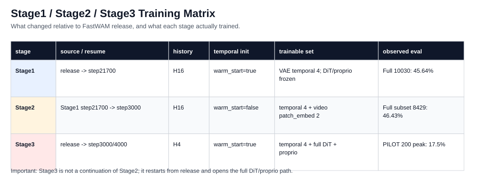
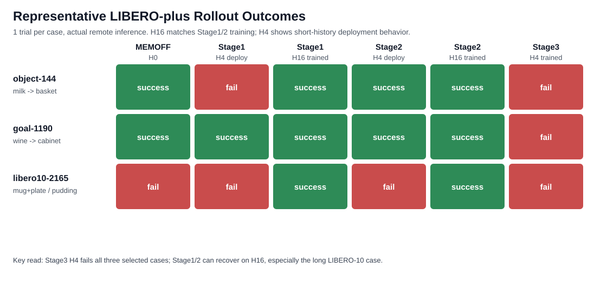

# MEM-VAE Stage 训练细化与 Case Comparison

日期：2026-06-21  
分支：`feat/mem-vae`  
远端项目：`/data/home/frank/projects/FastWAM`  
远端机器：`maxliu-h200-qinghua-1`

## 0. 这份文档补了什么

这次补充的重点不是再重复“stage3 变差”，而是把三个问题拆开：

1. **stage1 / stage2 / stage3 分别怎么训练、怎么处理 history、从哪里 resume、到底解冻了谁。**
2. **三次训练对 rollout 的更细影响是什么，尤其是 H16 与 H4 的差别。**
3. **用实际远端 inference 跑代表性 case，比较 MEMOFF、stage1、stage2、stage3 的成功/失败与视频路径。**

所有 case 视频已经在远端生成。当前本地 `scp` 下载连续被 Codex 审批器拦住，所以本地文档暂时保留远端 MP4 路径；原始结果表见：

- `26-06-21-mem-vae-stage-case-raw-data.csv`
- `26-06-21-mem-vae-stage-training-raw-data.csv`

## 1. Stage 总览



### Stage1：只训 VAE memory temporal 参数

事实：

- 脚本：`scripts/train_mem_temporal.sh`
- 起点：`checkpoints/fastwam_release/libero_uncond_2cam224.pt`，或已有 DeepSpeed state auto-resume。
- history：`data.train.history_video_frames=16`
- `model.vae_memory.enabled=true`
- `model.vae_memory.warm_start=true`
- `model.vae_memory.train_temporal_only=true`
- 可训练集合：只解冻 VAE memory 的 temporal params，即 `temporal_proj / temporal_gate / temporal_pos`。
- DiT、proprio encoder、base VAE 都冻结。
- 代表 ckpt：`runs/mem_temporal_libero/checkpoints/weights/step_021700.pt`
- 既有 full eval：LIBERO-plus 10030 cases 为 45.64%，比 MEMOFF 49.83% 小幅下降。

代码证据：

- `scripts/train_mem_temporal.sh:29-35` 设置 memory on、warm start、temporal only、H16。
- `src/fastwam/trainer.py:327-341` 在 memory mode 下先全冻结，再只解冻 `MEMORY_PARAM_KEYS`。

影响：

- 它没有把策略主体训坏，因为主 DiT 和 proprio 没动。
- 但它改变了 conditioning first-frame latent，冻结 DiT 只能被动读这个新 latent，所以总体成功率小幅掉。
- 对长任务，H16 可能是有用的：`libero10-2165` 中 MEMOFF 失败，stage1 H16 成功。

### Stage2：在 stage1 上额外解冻 video patch embedding

事实：

- 脚本：`scripts/train_mem_stage2.sh`
- 起点：stage1 `step_021700.pt`
- resume 方式：`.pt` weights-only，optimizer/scheduler/step 重置。
- history：`data.train.history_video_frames=16`
- `warm_start=false`，避免 stage1 已学到的 temporal params 被 spatial proj 覆盖。
- `train_temporal_only=true`
- `unfreeze_patch_embed=true`
- 可训练集合：stage1 的 temporal params + `video_expert.patch_embedding` weight/bias 两个张量。
- 代表 ckpt：`runs/mem_temporal_libero_stage2/checkpoints/weights/step_003000.pt`
- 既有 eval：step3000 在 8429-case subset 上 46.43%，注意这个不含 Noise，不能直接和 10030-case MEMOFF/stage1 横比。

代码证据：

- `scripts/train_mem_stage2.sh:29-57` 明确从 stage1 ckpt 继续、H16、warm_start=false、unfreeze_patch_embed=true。
- `src/fastwam/trainer.py:342-360` 只在 `unfreeze_patch_embed=true` 时解冻 video patch embedding。
- `src/fastwam/trainer.py:277-290` 说明 `.pt` resume 是 weights-only，不恢复 optimizer/scheduler。

影响：

- 它是“接口适配”阶段：只让 DiT 输入层学会读 memory-modified latent。
- 权重漂移证据显示 stage2 没动 action head/proprio/video blocks，说明它没有 stage3 那种主体漂移风险。
- case 上，stage2 H16 和 stage1 H16 在三个样例里都没有崩；`libero10-2165` 同样从 MEMOFF fail 变成 success。

### Stage3：从 release 冷启动，全 DiT + proprio + temporal 联合训练

事实：

- 脚本：`scripts/train_mem_stage3.sh`
- 起点：release `checkpoints/fastwam_release/libero_uncond_2cam224.pt`
- 不是从 stage2 continuation。
- history：`HISTORY=4`
- `warm_start=true`
- `train_temporal_only=false`
- 可训练集合：VAE temporal params + full DiT + proprio。
- 代表 ckpt：`runs/mem_temporal_libero_stage3/checkpoints/weights/step_003000.pt`
- 既有 eval：PILOT 200 cases 中 step3000 峰值 17.5%，step4000 为 17.0%。

代码证据：

- `scripts/train_mem_stage3.sh:30-67` 明确 H4、release 起点、full-DiT joint finetune。
- `src/fastwam/trainer.py:327-336` 当 `train_temporal_only=false` 时，`model.dit` 和 `proprio_encoder` 都进入 trainable。

影响：

- 这不是“在 stage2 好的地基上继续微调”，而是重新从 release 打开 full-DiT。
- 已有 weight drift 说明 stage3 在 step500 已经产生主体漂移：video blocks/action head/proprio 明显偏离 release，后续 step500->4000 变化反而很小。
- 本次三个实际 rollout case 中，stage3 step3000 H4 全部失败；这和 PILOT 17.5% 的总体崩盘一致。

## 2. Case Outcome Matrix



这张图来自远端实际 `eval_libero_single.py` rollout，每个 case 跑 1 trial，并保存 MP4。

重要口径：

- MEMOFF 使用 H0。
- Stage1/Stage2 原训练和 full eval 是 H16，所以 H16 结果代表原始口径。
- Stage1/Stage2 的 H4 结果是额外部署检查，用来和 stage3 的短历史设定对齐。
- Stage3 训练就是 H4，所以只跑 H4。

## 3. Case 逐项解读

### Case A：`libero_object/task_id=144`

任务：`pick up the milk and place it in the basket table 23`

结果：

- MEMOFF H0：success
- stage1 H4：fail
- stage1 H16：success
- stage2 H4：success
- stage2 H16：success
- stage3 H4：fail

解读：

- 这个 case 说明 stage1 的短历史 H4 部署不一定稳定；但一旦回到训练口径 H16，stage1 恢复成功。
- stage2 在 H4/H16 都成功，说明 patch embedding 适配至少在这个简单 object case 上更稳。
- stage3 失败不是因为这个 case 本身很难，因为 MEMOFF/stage1 H16/stage2 都能过。

远端 MP4：

- MEMOFF：`/tmp/fastwam_case_videos/26-06-21/libero_object_144/memoff/libero_object/videos/2026_06_21-18_51_37--episode=task144_trial0--success=True--task=pick_up_the_milk_and_place_it_in_the_basket_table_.mp4`
- stage1 H4：`/tmp/fastwam_case_videos/26-06-21/libero_object_144/stage1/libero_object/videos/2026_06_21-18_53_31--episode=task144_trial0--success=False--task=pick_up_the_milk_and_place_it_in_the_basket_table_.mp4`
- stage1 H16：`/tmp/fastwam_case_videos/26-06-21/libero_object_144/stage1_h16/libero_object/videos/2026_06_21-19_00_13--episode=task144_trial0--success=True--task=pick_up_the_milk_and_place_it_in_the_basket_table_.mp4`
- stage2 H16：`/tmp/fastwam_case_videos/26-06-21/libero_object_144/stage2_step3000_h16/libero_object/videos/2026_06_21-19_00_13--episode=task144_trial0--success=True--task=pick_up_the_milk_and_place_it_in_the_basket_table_.mp4`
- stage3 H4：`/tmp/fastwam_case_videos/26-06-21/libero_object_144/stage3_step3000/libero_object/videos/2026_06_21-18_53_31--episode=task144_trial0--success=False--task=pick_up_the_milk_and_place_it_in_the_basket_table_.mp4`

### Case B：`libero_goal/task_id=1190`

任务：`could you ensure the wine bottle ends up on top of the cabinet`

结果：

- MEMOFF H0：success
- stage1 H4/H16：success
- stage2 H4/H16：success
- stage3 H4：fail

解读：

- 这是最干净的 stage3 regression case：除了 stage3，其他训练/部署口径都过。
- 因此它支持“stage3 full-DiT 解冻导致策略主体退化”的判断，而不是“memory 一开就必坏”。

远端 MP4：

- MEMOFF：`/tmp/fastwam_case_videos/26-06-21/libero_goal_1190/memoff/libero_goal/videos/2026_06_21-18_55_30--episode=task1190_trial0--success=True--task=could_you_ensure_the_wine_bottle_ends_up_on_top_of.mp4`
- stage1 H16：`/tmp/fastwam_case_videos/26-06-21/libero_goal_1190/stage1_h16/libero_goal/videos/2026_06_21-19_00_13--episode=task1190_trial0--success=True--task=could_you_ensure_the_wine_bottle_ends_up_on_top_of.mp4`
- stage2 H16：`/tmp/fastwam_case_videos/26-06-21/libero_goal_1190/stage2_step3000_h16/libero_goal/videos/2026_06_21-19_00_13--episode=task1190_trial0--success=True--task=could_you_ensure_the_wine_bottle_ends_up_on_top_of.mp4`
- stage3 H4：`/tmp/fastwam_case_videos/26-06-21/libero_goal_1190/stage3_step3000/libero_goal/videos/2026_06_21-18_55_30--episode=task1190_trial0--success=False--task=could_you_ensure_the_wine_bottle_ends_up_on_top_of.mp4`

### Case C：`libero_10/task_id=2165`

任务：`put the white mug on the plate and put the chocolate pudding to the right of the plate add 15`

结果：

- MEMOFF H0：fail
- stage1 H4：fail
- stage1 H16：success
- stage2 H4：fail
- stage2 H16：success
- stage3 H4：fail

解读：

- 这是最重要的 case：它说明 memory 不是只有副作用。按 stage1/stage2 原始 H16 口径，memory 版本能过一个 MEMOFF 失败的长组合任务。
- 但同一个 ckpt 换成 H4 部署会失败，说明 stage3 把 history 缩到 H4 会损失长任务需要的上下文。
- stage3 H4 失败不能简单归咎于“历史太短”，因为它还同时 full-DiT 解冻并从 release 重启；但这个 case 强烈提示：未来不能把 H4 和 full-DiT 解冻混在一个 stage 里同时改，否则很难归因。

远端 MP4：

- MEMOFF：`/tmp/fastwam_case_videos/26-06-21/libero10_2165/memoff/libero_10/videos/2026_06_21-18_57_34--episode=task2165_trial0--success=False--task=put_the_white_mug_on_the_plate_and_put_the_chocola.mp4`
- stage1 H16：`/tmp/fastwam_case_videos/26-06-21/libero10_2165/stage1_h16/libero_10/videos/2026_06_21-19_00_13--episode=task2165_trial0--success=True--task=put_the_white_mug_on_the_plate_and_put_the_chocola.mp4`
- stage2 H16：`/tmp/fastwam_case_videos/26-06-21/libero10_2165/stage2_step3000_h16/libero_10/videos/2026_06_21-19_00_13--episode=task2165_trial0--success=True--task=put_the_white_mug_on_the_plate_and_put_the_chocola.mp4`
- stage3 H4：`/tmp/fastwam_case_videos/26-06-21/libero10_2165/stage3_step3000/libero_10/videos/2026_06_21-18_57_34--episode=task2165_trial0--success=False--task=put_the_white_mug_on_the_plate_and_put_the_chocola.mp4`

## 4. 关于 GT 对比的限制

事实：

- 当前 `eval_libero_single.py` 保存的是 policy rollout video，即模型在环境里闭环执行的实际视频。
- `visualize_future_video=true` 的 GT/pred future video 路径会调用 `model.infer_joint`。
- 代码里明确写了：`infer_joint / visualize_future_video does not support history_images`，所以这条路径不能作为 MEM-stage 的公平 GT 对比。

代码证据：

- `experiments/libero/eval_libero_single.py:501-504`：只有非 `visualize_future_video` 的 `infer_action` 路径会传 `history_images`。
- `src/fastwam/models/wan22/fastwam.py:1065-1075`：`infer_action` 在 memory enabled 且有 `history_images` 时，才会走 `_encode_memory_first_frame`。

结论：

- 本文档的 video inference 证据是 **GT success condition + actual rollout MP4**，不是 expert demonstration GT video。
- 如果要做严格的 “GT demo vs predicted action/video” 图，需要单独写 dataset offline inference：从 `RobotVideoDataset` 取一条带 `history_video / video / action` 的样本，分别加载 MEMOFF/stage1/stage2/stage3，比较预测 action 与 dataset action，并显示 dataset GT frames。这个实验不能用 `visualize_future_video=true` 直接替代，因为它不走 MEM history path。

## 5. 更细的影响判断

### 5.1 Stage1 的真实影响

事实：

- full eval 小幅低于 MEMOFF。
- H16 case 能救 `libero10-2165`。
- H4 部署下，object-144 和 libero10-2165 会掉。

推断：

- Stage1 学到的 memory temporal params 对长任务可能有效，但它依赖 H16 历史长度。
- 失败不是“memory 完全没用”，而是 frozen DiT + shifted conditioning latent + history-length mismatch 共同限制了收益。

### 5.2 Stage2 的真实影响

事实：

- stage2 H16 在三个 case 都能维持 stage1 H16 的成功。
- stage2 H4 比 stage1 H4 更稳地通过 object-144，但仍过不了 libero10-2165。

推断：

- `patch_embedding` 适配确实可能缓解 input latent 接口错配。
- 但 patch embedding 不能补偿 H4 对长任务的历史不足，也不能证明 stage2 已经总体超过 stage1，因为 full eval 口径不一致。

### 5.3 Stage3 的真实影响

事实：

- stage3 step3000 是 PILOT 峰值，但三个代表 case 全失败。
- stage3 从 release 重启，不继承 stage1/stage2。
- stage3 同时改了两个强变量：H16 -> H4，以及 full-DiT/proprio 解冻。

推断：

- stage3 的失败不能只归咎于 H4，也不能只归咎于 DiT 解冻；当前实验把两者混在一起。
- 但结合已有 weight drift，full-DiT/proprio 的早期大漂移是更危险的因素。
- 从 case 角度，stage3 没能保住 MEMOFF 能过的 object/goal，也没保住 stage1/2 H16 能救的 long case。

## 6. 下一步最小实验建议

1. **Stage3-continuation ablation**：从 stage2 H16 ckpt 继续，只解冻小范围 DiT，而不是从 release 重启 full-DiT。
2. **History ablation 分离变量**：固定 stage1/stage2/stage3 的 ckpt，分别跑 H4/H8/H16，尤其看 `libero_10`。
3. **严格 GT offline comparison**：对 dataset sample 做 action MSE、gripper accuracy、action trajectory plot、GT frames contact sheet；不要用当前 `visualize_future_video=true` 当 MEM GT。
4. **视频 contact sheet**：一旦本地 `scp` 授权通过，把远端 MP4 拉回 `docs/26-06-21/26-06-21-case-videos/`，抽取 0/25/50/75/100% 帧做同一 case 横向拼图。

待授权下载命令：

```bash
mkdir -p docs/26-06-21/26-06-21-case-videos
scp -r maxliu-h200-qinghua-1:/tmp/fastwam_case_videos/26-06-21/libero_object_144 docs/26-06-21/26-06-21-case-videos/
scp -r maxliu-h200-qinghua-1:/tmp/fastwam_case_videos/26-06-21/libero_goal_1190 docs/26-06-21/26-06-21-case-videos/
scp -r maxliu-h200-qinghua-1:/tmp/fastwam_case_videos/26-06-21/libero10_2165 docs/26-06-21/26-06-21-case-videos/
```

## 7. 远端运行补充记录

远端环境中当前 SSH 用户是 `maxliu`，但历史实验环境位于 `/data/home/frank/.conda/envs/fastwam`。为了让 eval 可运行，本次用了两个非侵入式处理：

- `LIBERO_CONFIG_PATH=/tmp/fastwam_libero_config_codex`：临时 LIBERO config，避免 import 时交互提问。
- `PYTHONPATH=/tmp/fastwam_sitecustomize_codex`：重定向 robosuite 硬编码的 `/tmp/robosuite.log`，避免 `frank` 用户留下的日志文件权限问题。
- `hydra.run.dir=/tmp/fastwam_case_videos/.../hydra`：避免 Hydra 往 `/data/home/frank/projects/FastWAM/eval_libero_single.log` 写日志。

这些都是运行环境修复，没有改 repo 代码、没有改 conda site-packages。
