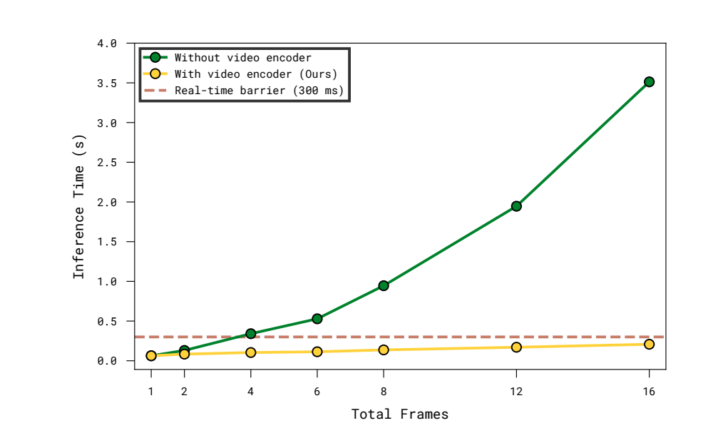
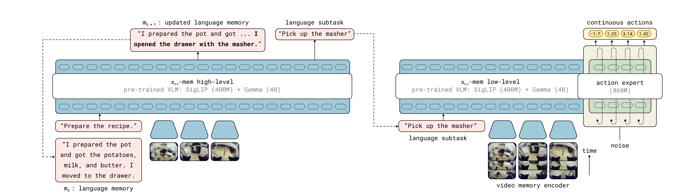
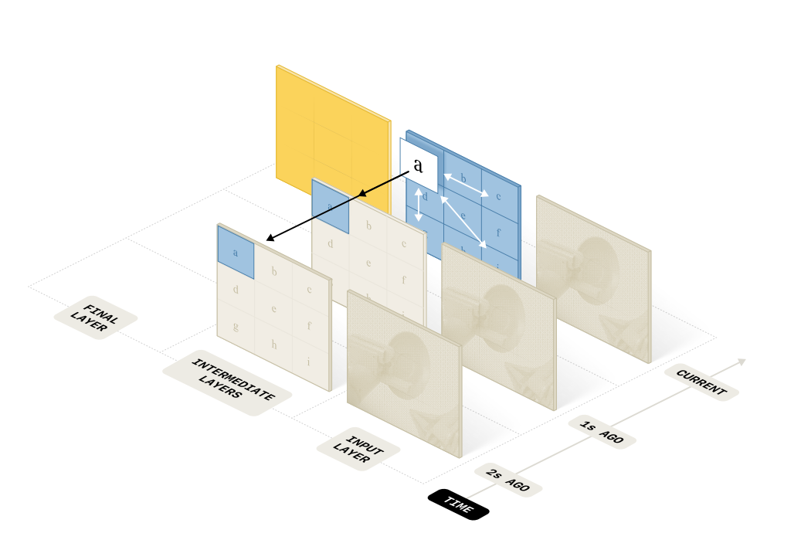
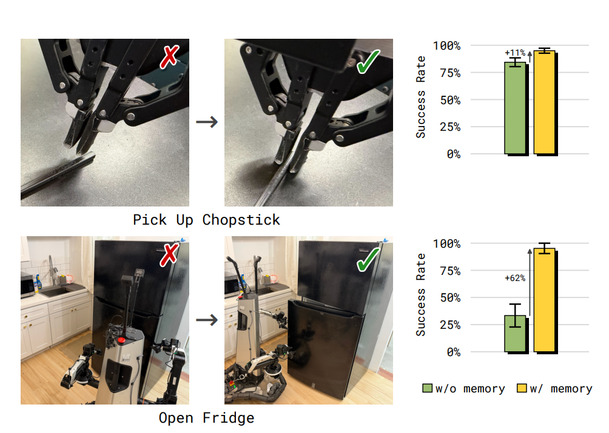
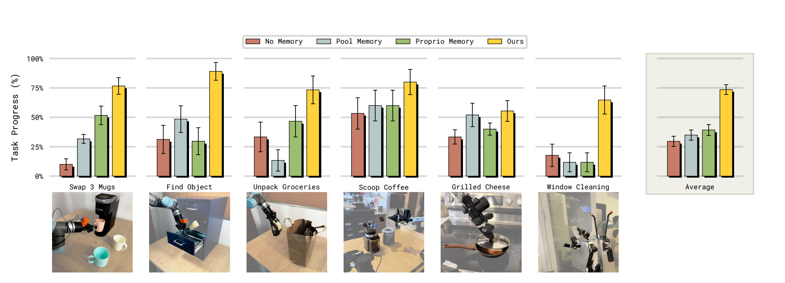
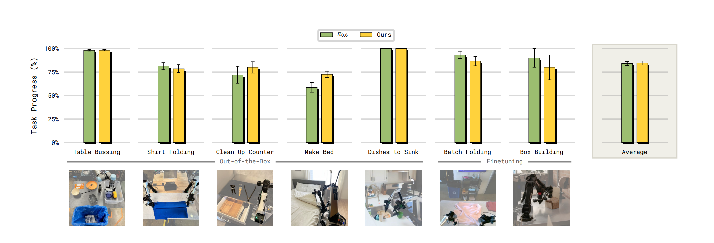
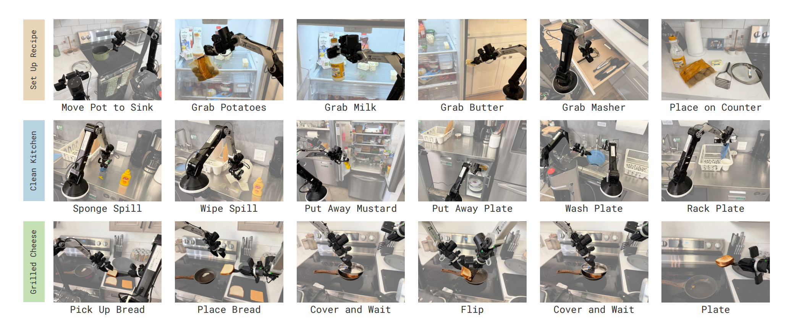
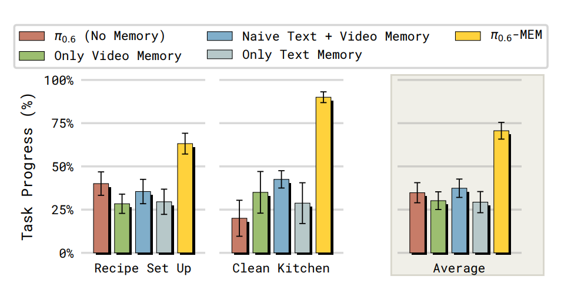

# MEM 论文分享稿

日期：2026-06-30

论文：`papers/Torne 等 - MEM Multi-Scale Embodied Memory for Vision Language Action Models.pdf`

## 一句话

MEM, Multi-Scale Embodied Memory, 是给 VLA 加多尺度记忆的系统：短期细节用视频记忆，长期任务进度用语言记忆，从而让机器人在真实延迟约束下完成需要几分钟到十几分钟记忆的任务。

## 分享主线

这篇论文要解决的问题不是“VLA 能不能看更多帧”这么简单，而是：机器人任务里的记忆本来就有不同粒度。

- 最近几秒的记忆需要保留视觉和动作细节，比如物体被手臂挡住、刚才抓取失败、门往哪边打不开。
- 几分钟级别的记忆通常只需要语义状态，比如菜谱哪些材料已经拿了、厨房哪些区域已经清理过。
- 如果把十几分钟的视频全部塞进 VLA，计算和延迟不可接受；如果只用文本，又丢失低层空间和动态细节。

MEM 的核心答案是混合模态记忆：短期用 dense video memory，长期用 compressed language memory。论文把它集成进 `pi0.6` VLA，并展示可以处理最高约 15 分钟记忆需求的任务。

## 背景动机

传统端到端机器人 policy 常见做法是把过去若干 observation 拼进模型上下文。但长任务里这个思路会很快失控：


- 图像 token 数随着相机数、帧数、patch 数增长，推理延迟上升很快。
- 长期任务进度不一定需要保存原始图像，例如“已经放了三只碗到右上柜子”只需要很少语义信息。
- 反过来，短期纠错又不能只靠语言，例如抓筷子时需要记住刚才抓取高度失败了，门打不开时要记住刚才尝试过哪边。

论文因此提出：有效的 embodied memory 应该按时间尺度和抽象层级分工。

## 方法总览

MEM 把策略分成高层和低层两个部分。


```text
长程任务目标 g
当前 observation o_t
上一轮语言记忆 m_t
        |
        v
高层 policy pi_HL:
  预测下一步子任务 l_{t+1}
  更新语言记忆 m_{t+1}
        |
        v
低层 policy pi_LL:
  输入短窗口 observation o_{t-K:t}
  输入子任务 l_{t+1}
  输出连续 action chunk a_{t:t+H}
```

关键 factorization 是：

```text
pi(a_{t:t+H}, l_{t+1}, m_{t+1} | o_{t-T:t}, m_t, g)
  ~= pi_LL(a_{t:t+H} | o_{t-K:t}, l_{t+1}, g)
     pi_HL(l_{t+1}, m_{t+1} | o_t, m_t, g)
```

这里 `K << T`。也就是说，低层不看全历史，只看短窗口视频；高层通过文本 memory 负责把更远过去的语义状态带过来。

## 长期语言记忆

语言记忆 `m_t` 是对过去语义事件的压缩摘要。高层 policy 每一步根据当前 observation、任务目标和旧 memory 生成新 memory。

例如：

```text
m_t:   我把盘子放进柜子，并移动到了台面旁。
m_t+1: 我把盘子放进柜子，移动到了台面旁，并拿起了一个碗。
```

训练数据来自一个自动标注 pipeline：

- 机器人 episode 有 subtask language annotations。
- 把 subtask 序列以及每个 subtask 成功/失败信息交给离线 LLM。
- 让 LLM 生成“对未来执行仍然相关”的记忆摘要。
- 特别要求 LLM 在合适时删除或压缩不必要细节。

这个压缩很重要。论文强调，如果只是把过去所有 subtask instruction 拼起来，会造成 train-inference distribution shift：训练 demo 通常接近最优，一个 subtask 只说一次；推理时失败可能导致同一个 subtask 重复出现多次。MEM 的摘要式 memory 可以在失败还没真正完成时不更新 memory，从而减少这种分布偏移。

## 短期视频记忆


短期视频记忆负责最近几秒到几十秒的密集视觉上下文，用来处理：

- 自遮挡。
- 物体短时不可见。
- 刚才失败的操作。
- 动态和时序判断。
- 低层操作策略的 in-context adaptation。

论文没有简单地把多帧分别编码后全部送进 VLA backbone，而是改造 ViT vision encoder 成 video encoder。

主要设计：

- 每一帧先正常 patchify。
- 大多数层保持标准 spatial attention。
- 每第 4 层加入 temporal attention。
- temporal attention 是沿同一个 image patch 的时间维做 causal attention。
- 空间和时间 attention 分解计算，避免在所有时空 token 上做完整 joint attention。
- 上层只保留当前 timestep 的 token，丢掉过去帧 token。

这样做的结果是：进入 VLA backbone 的 token 数和单帧 VLA 基本一致，但当前帧 token 已经吸收了过去帧信息。

## 视频 encoder 的关键细节

论文强调这个 video encoder 有一个很实用的性质：相比原始单图 ViT，不引入新的可学习参数。

- 复用原 ViT 的 Q/K/V 和 projection 权重。
- 增加的是 attention pattern 的改变。
- 时间位置编码是固定 sinusoidal temporal position encoding。
- 当前帧 `t=0` 的时间位置编码设为 0。
- 当 `K=1` 单帧输入时，初始化行为精确匹配原 VLM 的 image encoder。

这点很关键，因为它允许从现成 VLM 权重初始化，不必从零训练一个视频 encoder。

## pi0.6-MEM 实例化

论文把 MEM 接到 `pi0.6` VLA 上。

- backbone 初始化自 Gemma3-4B VLM。
- vision side 使用 SigLIP 级别的预训练视觉编码器。
- action 侧同时使用离散 FAST action token prediction 和一个 860M 参数的 flow-matching action expert。
- action expert 的梯度不回传到 VLM backbone。
- 输入分辨率为每个 camera stream `448x448`。
- 最多使用 4 路相机。
- 过去 proprioception 不再用文本串表示，而是通过 linear projection 变成连续 state tokens，避免 state text tokens 爆炸。

预训练设置：

- 预训练数据混合了 teleoperated robot demonstrations、policy rollout data、human corrections、vision-language tasks、video-language tasks。
- 预训练时使用 6 个 observation，也就是 5 个过去 observation 加当前 observation。
- 帧间 stride 为 1 秒。
- post-training 时可以扩展 observation memory horizon，实验中扩到 18 帧、约 54 秒。

## 实验 1：长程任务

论文用两个长程真实机器人场景测试最高约 15 分钟记忆需求。

1. Recipe setup

机器人根据 recipe prompt 从冰箱、柜子、抽屉等位置取出材料和厨具，放到指定位置。它需要记住哪些物品已经拿了，哪些门/抽屉最后要关上。训练覆盖 42 个 recipes，评估在 unseen kitchens 和 unseen objects 上做。

2. Clean up kitchen

机器人清理厨房，包括擦台面、用纸巾擦干、把食物放回冰箱、洗盘子、放到晾碗架等。它需要记住洗盘子是否加过 soap、盘子正反面是否洗过、哪些台面清理过。

结论：

- 无记忆的 `pi0.6` 在这类任务上表现困难。
- 只有视频 memory 不够，因为远期语义进度会丢。
- 只有文本 memory 也不够，因为低层动作和近期细节不足。
- naive text + video memory 也明显弱于 MEM，因为拼接历史 subtask instruction 会带来训练/推理分布偏移。
- 完整 MEM 最强，说明短期视频 + 长期压缩语言是互补的。

## 实验 2：In-Context Adaptation


论文还测试了短任务中 memory 是否能帮助策略“看到自己刚失败过，然后换一种做法”。

两个任务：

- Pick up chopstick：桌子高度 out-of-distribution，容易误抓。记忆模型可以根据过去失败抓取调整高度。
- Open fridge：冰箱门没有明显 hinge 方向提示，模型需要记住刚才从错误方向打不开，然后换方向。

训练方式：

- 收集 targeted human feedback。
- 当 policy 失败后，人类接管并演示正确策略。
- finetune 时保留失败尝试在短期 memory 中，让模型学会根据失败上下文改变策略。

结果趋势：

- Pick up chopstick：带 memory 版本比无 memory 高约 `+11%` 成功率。
- Open fridge：带 memory 版本比无 memory 高约 `+62%` 成功率。

这里的重点是：无 memory policy 即使看过 correction data，也不知道自己刚才试过什么；MEM 能把失败尝试作为上下文使用。

## 实验 3：和其他 memory 方案对比


论文比较了几类 memory：

- No Memory：标准 `pi0.6`。
- Pool Memory：把过去 observation 分别编码，再 average pooling 成 memory token。
- Proprio Memory：只输入过去机器人低维 proprioceptive states。
- Ours：MEM 的视频 encoder 版本，在该分析里不使用长期语言 memory，专注比较 observation-based memory。
- Ours post-train only：只在 post-training 加 video encoder，不在大规模预训练阶段培养 memory 能力。

任务覆盖：

- Swap 3 mugs：记住多个杯子的过去位置。
- Find object：记住人把物体放进 4 个抽屉中的哪一个。
- Unpack groceries：袋内物体数量不完全可见，需要记住还剩多少。
- Scoop coffee：精确记住加了几勺。
- Grilled cheese：记住烹饪等待时间和阶段。
- Window cleaning：记住哪些步骤完成、哪些区域擦过。

结论：

- No Memory 在很多任务上只能接近随机，比如 4 个抽屉找物体约 25% chance，是否再加一勺咖啡约 50% chance。
- Pool Memory 对简单任务有帮助，但平均池化太激进，容易丢多个对象位置或袋内剩余物体这种细节。
- Proprio Memory 对“记住机器人自己状态”的任务有帮助，但对环境状态记忆弱。
- MEM 是唯一在所有核心 memory capabilities 上都表现强的方案。

## 预训练为什么关键

这是分享时很可能被问到的点。

论文明确指出：在大规模、多样化 robot + non-robot video data 上预训练 observation-based memory，会显著提升模型利用 memory 的能力。即使 post-training 时把 memory horizon 从预训练的 5 秒扩到接近 1 分钟，预训练过 memory 的模型仍然更好。

关键对照是 `Ours` vs `Ours (post-train only)`：

- `post-train only` 不是从随机模型开始，它也初始化自同一个已经大规模预训练过的 `pi0.6` checkpoint。
- 差别在于这个 checkpoint 预训练时没有发展 memory capabilities。
- 实验显示，后期才加 memory encoder 明显不如从预训练阶段就让模型学习如何使用过去信息。

论文给出的解释是：多样化预训练数据包含不同 optimality、速度、控制频率的 robot episodes，以及多样 internet videos。这种多样性可以减少小规模、同质机器人数据中容易出现的 spurious correlations，从而避免 memory policy 常见的 causal confusion 和性能退化。



## 可以怎么评价这篇论文

优点：

- 问题定义清晰：把机器人 memory 拆成短期 dense visual memory 和长期 semantic language memory。
- 架构务实：video encoder 不增加可学习参数，能复用 VLM 权重。
- 关注真实推理延迟：不是简单堆长上下文。
- 实验任务非常贴近真实机器人长程操作。
- 预训练结论对 VLA memory 设计很有启发。

局限：

- 长期 language memory 依赖 LLM 生成训练标签，pipeline 复杂。
- memory 更新错误可能在长任务中传播。
- 论文很多结果来自真实机器人图表，PDF 没给完整数值表，不利于复现精确数字。
- 模型规模和数据规模很大，小团队很难完全复现。
- 语言 memory 更适合语义阶段状态，未必适合低层动作平滑。

## 和 FastWAM 的关系

对 FastWAM 最重要的借鉴有三点。

1. 记忆应该分层

FastWAM v4 当前已有短历史 video/action K/V condition，更像 MEM 的 short-term dense memory。MEM 提醒我们：如果要做分钟级任务，只靠扩展 dense history 不现实，需要中长期压缩 memory。

2. 预训练阶段就引入 memory 很重要

如果 FastWAM 只在 finetune/post-training 加 memory，可能会出现和论文 `post-train only` 类似的问题：模型知道怎么单帧/短窗做动作，但没有在大规模数据中学会“什么时候过去信息有用”。

3. 历史压缩要匹配用途

动作平滑和纠错需要短期 dense/action memory；任务阶段、counting、已完成步骤可能需要 semantic/event memory。不要把所有 memory 都塞进同一个表示里。



