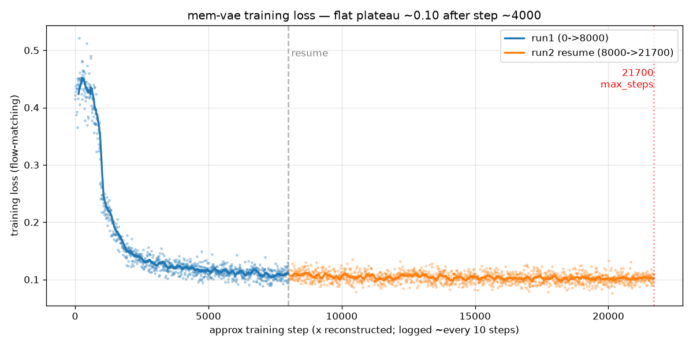
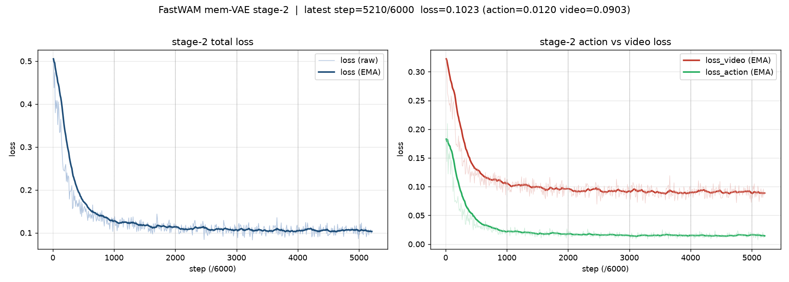
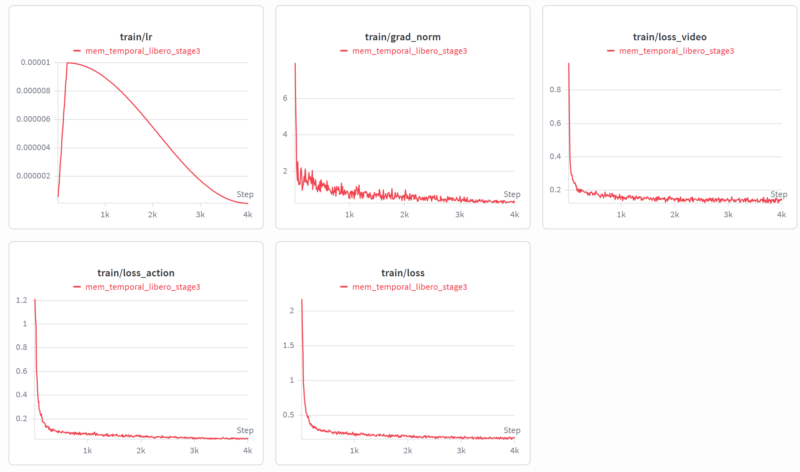

# Mem-VAE 实验记录(experiment log)

> 分支 `feat/mem-vae`。给 FastWAM 加 **VAE 短期记忆**(temporal memory),
> 目标:在 LIBERO-plus 鲁棒性测试上 **超过无记忆基线**,证明「短期记忆提升鲁棒性」。
> 配套计划见 [mem_vae_eval_and_finetune_plan.md](mem_vae_eval_and_finetune_plan.md)。
> 本文件只记「跑了什么 / 得了多少分 / 下一步」,持续更新。

---

## 0. 评测协议与基线

- **benchmark**:LIBERO-plus(arXiv 2510.13626),8429 个非 noise case,7 因子
  (Camera / Robot / Lang. / Light / BG / Noise / Layout),难度 L1–L5。
- **每 case rollout 1 次**(num_trials=1),Total = 全部 case 整体成功率。
- 评测脚本:`scripts/eval_libero_plus.sh` + `experiments/libero/summarize_libero_plus.py`。

| 基线 | LIBERO-plus Total | 口径 | 说明 |
|---|---|---|---|
| Fast-WAM(paper 原版) | 51.5 | — | 论文 Table 4 报告值 |
| **mem-off(本仓库复现,无记忆)** | **49.83** | noise-inclusive | 我们的目标:要超过它 |
| **mem-on stage-1**(当前可比最好) | **45.64** | noise-inclusive | 见 §1,**记忆净负 ~4.2**;失败=接口错配 |
| mem-on stage-2 | 46.9 | **no-noise(8429)** ⚠️ | 见 §2,**口径不同,不可与上面直接比** |
| mem-on stage-3(全解冻冷启动) | 17.5(峰值,PILOT) | noise-inclusive(PILOT 200/点) | 见 §5,**崩**;失败=训练/rollout 泛化裂缝 |

> **⚠️纠正:** stage-2 的 46.9 是在 **不含 noise 的 8429 集** 上算的,
> 跟 49.83 / 45.64 的 noise-inclusive 口径**不可比**。所以 stage-2 的"+1.3"是假象,
> **当前真正可比的最好成绩仍是 stage-1 的 45.64**。渐进解冻并未被证明真的超过 stage-1。

---

## 1. Stage-1 — 只训 VAE temporal 4 参数(DiT 全冻)

| 项 | 值 |
|---|---|
| 脚本 | `scripts/train_mem_temporal.sh` |
| run 目录 | `runs/mem_temporal_libero/` |
| ckpt | `runs/mem_temporal_libero/checkpoints/weights/step_021700.pt` |
| 可训练参数 | **4 个**(VAE memory temporal attn / pos / proj) |
| DiT / MoT / base VAE | 全冻结 |
| 训练量 | 10 epoch,batch 16,step 0→21700(已收敛,loss ~step4000 压平) |
| history | `history_video_frames=16` → **3.2s**(16×4÷20) |

**成绩:**
- 标准 LIBERO(无扰动)Avg **95.9**(原版 97.6,-1.7;Long 掉最多 -3.0)。
- LIBERO-plus Total **45.64**(noise-inclusive,< mem-off 49.83,**记忆净负 ~4.2**)。

**失败原因(接口错配,不是崩):** 冻死的 DiT 输入层 `patch_embedding` 是在「无记忆
latent」上训出来的,读不懂被记忆改写过的 latent → 接口错配、记忆净负(不是记忆本身没
价值,而是 DiT 没机会适应)。Long suite 掉最多正是佐证。**这是"小幅净负",rollout 本身
不崩(标准 LIBERO 仍 95.9)**
---

## 2. Stage-2 — 额外解冻 DiT 输入接口 patch_embedding(2 参数)

| 项 | 值 |
|---|---|
| 脚本 | `scripts/train_mem_stage2.sh` |
| run 目录 | `runs/mem_temporal_libero_stage2/` |
| ckpt | `checkpoints/step_1000.pt` … `step_6000.pt`(每 1000 存一次) |
| resume | weights-only,从 stage-1 `step_021700.pt`(optimizer/step 重置) |
| 可训练参数 | **6 个** = temporal 4 + `video_expert.patch_embedding` 2 |
| 超参 | 4 卡 × bs32 = global 128,lr 3e-5,max_steps 6000,cosine+5% warmup |
| history | `history_video_frames=16` → 3.2s(与 stage-1 一致,可比) |

**成绩:**

| Camera | Robot | Lang. | Light | BG | Layout | **Total** |
|---|---|---|---|---|---|---|
| 8.1 | 38.8 | 64.6 | 79.1 | 38.7 | 58.0 | **46.9** |

- 短板:**Camera 8.1**。

**失败原因(仍净负):**
1. **不含 noise 的 8429 集** 上算的,与 49.83 /
   45.64 的 noise-inclusive(10030)口径不一致。需要重新跑libero plus含noise，但可以确定的是比stage1更差
2. **即便只看接口对齐方向:** 只解冻 `patch_embedding`(6 参数)自由度仍不够,记忆 latent
   的表征错配没修透,离 49.83 还差 2.9。

> 教训:**以后所有 libero-plus eval 一律 `INCLUDE_NOISE=1`(10030),否则不可比。**

---

## 3. 历史帧换算方法

**历史秒数 = history_video_frames × action_video_freq_ratio ÷ fps**

- LIBERO:`action_video_freq_ratio=4`([configs/data/libero_2cam.yaml](../configs/data/libero_2cam.yaml)),`fps=20`。
- 约束:`history_video_frames` 必须是 **4 的倍数**(VAE memory 要求 (K+1)%4==1)。
- **换数据集必须重算**(fps / ratio 都可能不同)。

| history_video_frames | LIBERO 跨秒数 |
|---|---|
| 4 | 0.8s |
| 8 | 1.6s |
| 12 | 2.4s |
| 16(stage-1/2 现状) | 3.2s |

如果我们要在1.2s之内，就用H4吧，这也是我stage3用的

---

## 5. Stage-3 — 从 base 冷启动,全 DiT + temporal 联合 co-adapt(H4)

> 思路转向:**不再在 stage-1/2 的歪地基上打补丁**。从 base 原版 ckpt 冷启动,
> 整个 DiT 自由适应带记忆的 latent,从一开始就 co-adapt。更改方向：历史砍到 H4。

| 项 | 值 |
|---|---|
| 脚本 | `scripts/train_mem_stage3.sh`(`HISTORY` 参数化,默认 4) |
| run 目录 | `runs/mem_temporal_libero_stage3/` |
| 起点 ckpt | `checkpoints/fastwam_release/libero_uncond_2cam224.pt`(base 原版,mem-off 49.83) |
| resume | weights-only 冷启动(不继承 stage-1/2);有 DeepSpeed state 则续(须保持 8 卡) |
| warm_start | **true**(temporal 4 参数从 spatial proj 初始化) |
| 可训练 | **全 DiT(video+action expert ~5.9B)+ proprio + temporal**(`train_temporal_only=false`) |
| history | **4** → 0.8s(ratio4/fps20) |
| 卡 / batch | **8 卡 × bs32 = global 256** |
| lr | **1e-5**,cosine + 5% warmup(全解冻 blast radius 大,比 stage-2 的 3e-5 更保守) |
| max_steps | **4000**(~3.7 epoch); |
| save_every | **500**(8 个存档点) |

**为什么全解冻(vs AdaLN/BitFit):** 仓库只有三档(temporal-only / +patch_embed / 全解冻),
无 LoRA/AdaLN 中间档。病根是「DiT 读不懂记忆 latent」属接口/表征错配,AdaLN 那点
缩放未必修得动,全解冻自由度才够真正 co-adapt。**全解冻不贵**:stage-2 的 backward
本就穿过全网到输入层 patch_embedding,FLOPs ≈ 全解冻;只多优化器状态(~6G/卡)+ 梯度
缓冲(~12G/卡),峰值 ~85-90G/140G,单步 +10-30%,叠加 H4 整体仍 ~6h。OOM 回退 bs24。

**成绩(PILOT=200/各点,H4 eval,2026-06-20):**

| step | **Total** | Camera | Robot | Lang. | Light | BG | Layout |
|---|---|---|---|---|---|---|---|
| 1000 | 2.0 | 0 | 0 | 2.7 | 7.4 | 0 | 2.8 |
| 2000 | 12.5 | 0 | 19.4 | 18.9 | 14.8 | 3.9 | 16.7 |
| 3000 | **17.5(峰值)** | 0 | 25.0 | 29.7 | 22.2 | 0 | 25.0 |
| 4000 | 17.0(已掉头/压平) | 0 | 16.7 | 29.7 | 29.6 | 0 | 25.0 |

> **曲线 2.0 → 12.5 → 17.5 → 17.0:step 3000 即峰值。
> 峰值 17.5 也只有 stage-1 45.64 的零头。**Camera / BG 全程 0**,goal/long 类接近 0 = 典型 rollout 不稳。

**失败原因(全解冻冷启动 = 训练/rollout 泛化裂缝,不是权重损毁):**
- 训练 loss **健康**:warmup 起点 2.18(action 1.21/video 0.96)→ 收敛到 **0.178**(action 0.038/
  video 0.14),与 stage-1 的 ~0.10 同量级(略高由 H4 上下文更短解释)。加载日志正常
  (`[cold-start] warm-starting ...`,无 missing-keys)。**loss 收敛 ⇒ 底座没在权重空间被毁。**
  
- 但 eval 成功率崩到 2-17.5%。**训练 loss 健康 + eval 崩 = 训练/rollout 泛化裂缝**:全解冻让
  DiT 走了一条"只在 teacher-forcing 单步预测下最优、闭环自回归 rollout 下不稳"的路(exposure
  bias / 误差累积)。stage-1/2 冻死 DiT,走不上这条路,locked DiT 保住了 base 的 rollout 稳定性。
- zero-init 门控([wan_video_vae.py:392](../src/fastwam/models/wan22/wan_video_vae.py#L392)
  `temporal_gate=torch.zeros(())`,前向 `x + tanh(gate)*temp`)只挡住第 0 步,挡不住几千步
  全解冻 DiT 的漂移。Camera 每点都 0、goal/long suite 接近 0 = 典型 rollout 不稳。

**确认实验(原版 LIBERO,2026-06-21 进行中):** 跑两个**真·原版 LIBERO**(无扰动,40 task×50 trial):
stage-2 step3000 @H16、stage-3 step4000 @H4。base=95.9。判读:**崩到 10-40% → rollout 裂缝坐实**;
**仍 ~95% → 底座没坏,问题只在 libero-plus 的 OOD**。

原版Libero启动前
> `export PYTHONPATH=/data/home/frank/projects/LIBERO:$PYTHONPATH` 

---

## 5. 实验目录速查

| 内容 | 路径 |
|---|---|
| stage-1 脚本 / run | `scripts/train_mem_temporal.sh` / `runs/mem_temporal_libero/` |
| stage-2 脚本 / run | `scripts/train_mem_stage2.sh` / `runs/mem_temporal_libero_stage2/` |
| stage-3 脚本 / run | `scripts/train_mem_stage3.sh` / `runs/mem_temporal_libero_stage3/` |
| 标准 LIBERO eval | `evaluate_results/libero/` |
| LIBERO-plus eval | `evaluate_results/libero_plus/stage2_step*_FULL/` |
| 评测脚本 | `scripts/eval_libero_plus.sh`,`experiments/libero/summarize_libero_plus.py` |
| wandb 看板 | wandb.ai/yichx14-uc-irvine/fastwam-mem |
